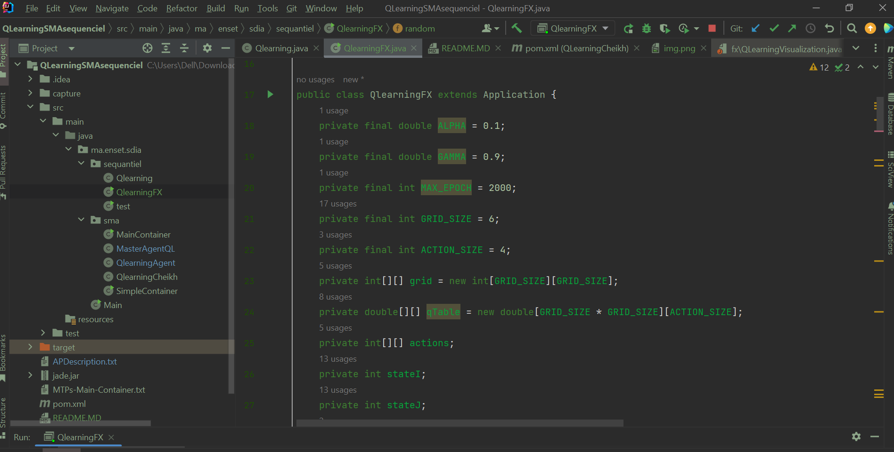
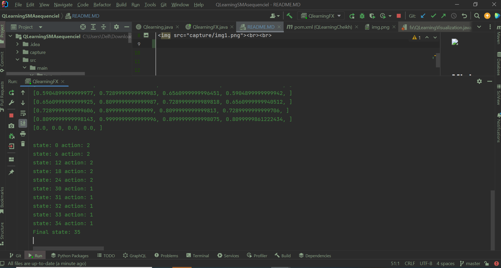
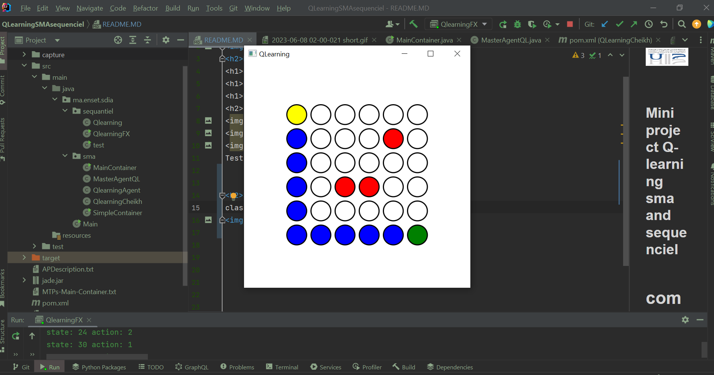

  
<h2>Mini project Q-learning sma and sequenciel</h2>
<h1>compte rendu</h1>
<h1>Beidja Cheikh</h1>
<h1>Master SDIA</h1>
<h2>sequenciel</h2>
  
  
  
Test   
<<<<<<< HEAD
  

<h2>SMA</h2>
Main container  
  
Master Agent  
  
QlearningAgent  
  

=======
  
https://github.com/BeidjaCheikh/QLearning/assets/131605799/8243a3cb-6638-49da-ab28-561558b11731
>>>>>>> ae55ded3e3f8920b5308018fae37ef3819441eda

